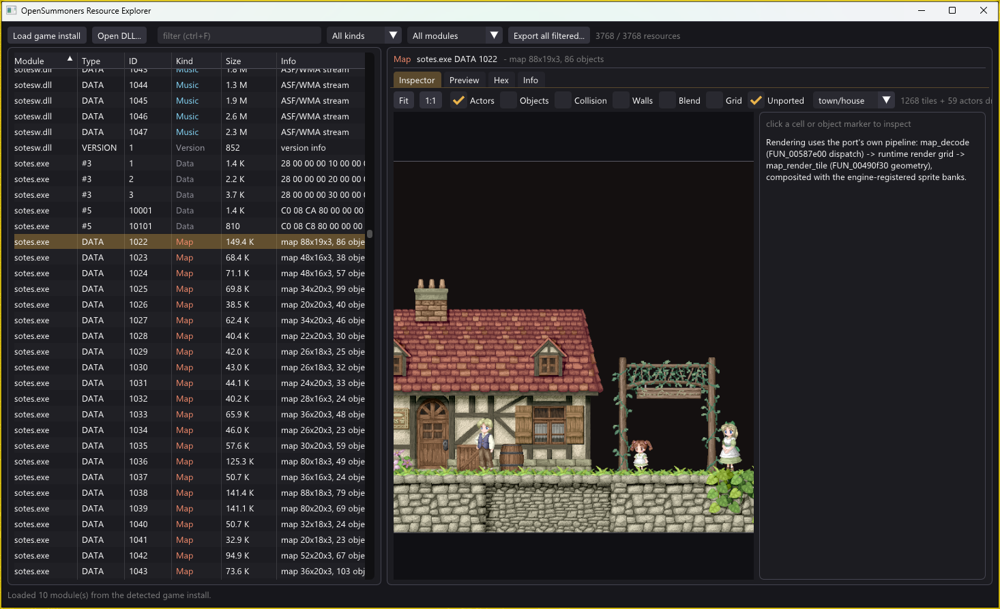
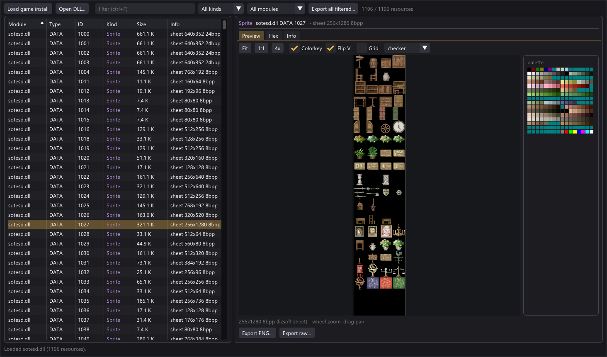
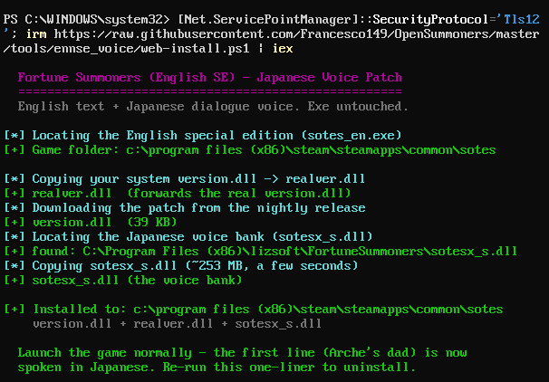

# OpenSummoners

An open-source reimplementation of **Fortune Summoners: Secret of the
Elemental Stone** (Lizsoft, 2008 JP / Carpe Fulgur, 2012 EN Steam release).

This is an **educational reverse-engineering and game-preservation project**.
The goal is a drop-in replacement for `sotes.exe` that behaves
indistinguishably from the original for a user who owns a legitimate copy of
the game.

**Not distributed:** no game assets, no decompiled binary code, no copyrighted
content of any kind.  You supply your own copy of the game (Steam).

## Status

**Early development — the port is not yet playable.** The engine core boots and the
opening arc (title → town intro → arrival cutscenes) already renders 1:1 against the
retail exe, but a playable game is still a long way off. In the meantime the project
ships two **finished, usable tools** — the resource explorer and the Japanese voice
patch below.

Development detail: [`docs/STATUS.md`](docs/STATUS.md) (current front),
[`docs/PLAN.md`](docs/PLAN.md) (roadmap), [`docs/PROGRESS.md`](docs/PROGRESS.md)
(changelog).

## Get the game (support the author)

Fortune Summoners is still on sale — if this project interests you, please buy the
game and support Lizsoft:

- **[Fortune Summoners Special Edition](https://store.steampowered.com/app/1381770/Fortune_Summoners_Special_Edition/)**
  (Steam, 2020) — published by Lizsoft directly; Japanese + English, Windows 10
  fixes. **Recommended**, and the edition the voice patch targets.
- [Fortune Summoners: Secret of the Elemental Stone](https://store.steampowered.com/app/203510/Fortune_Summoners/)
  (Steam, 2012) — the original Carpe Fulgur localization; the engine this port
  reimplements.
- The **voiced Japanese release** (the one that shipped the `sotesx_s.dll` voice
  bank) is **out of print** — see
  [`tools/ennse_voice/README.md`](tools/ennse_voice/README.md#where-the-voice-bank-comes-from)
  for the exact edition metadata if you want to hunt down a second-hand copy.

## Downloads

Every build is produced by CI and published to **[Releases](../../releases)** — each
ships **no game assets** (everything reads your own legitimately-owned files at
runtime). The rolling **`nightly`** pre-release always carries the latest build;
tagged `vX.Y` releases are cut at milestones.

### Resource explorer — `res_explorer.exe`

[](docs/media/res-explorer.png)

[](docs/media/res-explorer-sheets.png)

A native viewer/exporter for **every resource type** in the game's files, decoding
with the engine's own reverse-engineered code: **maps render exactly as in-game**
(tiles + scenery + props + townsfolk, with per-cell/per-object inspection and debug
overlays), sprite sheets (palette, colorkey, frame grid), sound effects and the
1,448-clip Japanese voice bank (waveform, seekable playback), BGM streams, string
tables — plus hex/info views and PNG/WAV/WMA/JSON/TXT export, per resource or in
bulk. Drop-in run: it auto-detects your install.
**[Download the nightly build](https://github.com/Francesco149/OpenSummoners/releases/download/nightly/res_explorer.exe)**
· docs: [`tools/res_explorer/README.md`](tools/res_explorer/README.md).

### Japanese voice patch (EN Special Edition)

[](docs/media/ennse-voice-install.png)

Restores **Japanese dialogue voice** to the English Special Edition (English text +
JP audio) — something no official English release ever shipped. Install by pasting
**one line into PowerShell** — it auto-detects your game + your JP `sotesx_s.dll`
and installs; re-run to uninstall. The exe is not modified. One-liner + manual zip:
[`tools/ennse_voice/README.md`](tools/ennse_voice/README.md).

### The port — `opensummoners.exe`

Drop it beside your Fortune Summoners install. Early development (see Status);
today it is a developer artifact, not a way to play the game.

## Getting started (NixOS / WSL2)

```fish
nix develop
./tools/setup.sh         # symlinks game into vendor/, runs Steamless, hashes binaries
```

This enters a dev shell with the full RE toolchain (Ghidra, radare2, mingw-w64
32-bit cross-compiler, Frida, Pillow/numpy/scikit-image, …) and prepares the
game files for analysis.

`sotes.exe` is **Steam-DRM packed** — the entry point lives in a `.bind`
section appended by the SteamStub wrapper.  `tools/setup.sh` runs
[Steamless](https://github.com/atom0s/Steamless) to produce a clean
`vendor/unpacked/sotes.unpacked.exe` that Ghidra can decompile directly.

## Layout

```
docs/         design notes, file-format specs, progress log, engine quirks
src/          our C reimplementation (cross-compiled with mingw32)
tests/        unit suite + scenario harness (golden BMP + audio/input traces)
tools/        setup, build, extract, capture, contact-sheet, ghidra-headless,
              Frida agent + capture driver, Job-Object launcher
vendor/       game files (gitignored) — symlinked from the user's Steam install
              + Steamless-unpacked sotes
ghidra/       Ghidra projects (gitignored — derived from the original binary)
runs/         test artifacts (gitignored)
```

## Workflow

Heavy use of a Frida-based harness against the retail exe for ground-truth
probing, with hidden-window + turbo + silent-audio defaults so a harness run
never disrupts the desktop:

- **Hidden window + turbo** from day 1 — the agent rewrites `ShowWindow` →
  `SW_HIDE`, virtualises `timeGetTime`, and no-ops `Sleep`, so the engine
  ticks as fast as the host can churn through it.
- **MessageBox auto-dismiss** in both the harness (Frida-side hook) and the
  drop-in (`dev_hooks.c` patches `user32!MessageBoxA/W` to log → IDOK).  A
  blocked modal dialog never silently stalls the run.
- **Job-Object launcher** wraps every `.exe` spawn so a SIGKILL on the WSL
  side atomically tears down the Windows-side game process — no stray
  processes after a botched run, ever.
- **Bit-exact frame diffs** between retail and our re-impl (once the DDraw7
  surface-lock hook lands), with red-tint overlay on mismatch.
- **Input trace** sparse JSONL format the harness replays into both targets
  for deterministic side-by-side runs.

The harness grows into a **TAS bot** that drives a whole game session at
inhuman speed, exercising different subsystems against retail and our
re-impl in lock-step.

## Sibling projects

OpenSummoners is the third in a series of sibling RE projects, each
distilling lessons from the last:

- **[openrecet](../openrecet)** — Recettear (the first; reference for
  hard-earned conventions)
- **[OpenMare](../OpenMare)** — Patrician III (newer, refined workflow —
  the closer model for OpenSummoners' shape)
- **OpenSummoners** *(this repo)* — Fortune Summoners

## Cross-references & credits

OpenSummoners' reverse engineering is cross-checked against independent community
work — most notably the **Fortune Summoners Fan Discord**
([invite](https://discord.gg/N68c7pt)) and their *SotES Data Formats & Values*
spreadsheet, which documents struct layouts, enums, addresses, and data tables for
`sotes.exe`. Our thanks to that community for their preservation work.

Their spreadsheet is consulted as a **cross-reference / lead**, not as ground truth:
every fact a port depends on is independently re-verified at the byte level against the
decompile + a host test before it is relied upon (the same discipline applied to our own
subsystem survey). Where our function-level RE 100%-proves something the spreadsheet is
missing or marks uncertain, we publish a **human-verifiable proof** others can reproduce
— see [`docs/ods-crossref.md`](docs/ods-crossref.md) and [`docs/proofs/`](docs/proofs).

## License

MIT.  See [`LICENSE`](LICENSE).  The license covers OpenSummoners' own code
only; no rights are granted to the original game.
